[](https://www.javadoc.io/doc/com.github.berkesa/moleculer-java-repl)

# REPL for Moleculer

Java REPL (Interactive Developer Console) for [Moleculer Microservices Framework](https://moleculer-java.github.io/moleculer-java/). The REPL console is a special Moleculer service that executes console commands. Console commands can be used to **test** Moleculer actions and event listeners or measure the **response time** of a service. It is also possible to create **custom commands**. The console can be used via standard input / output and telnet.

## Download

**Maven**

```xml
<dependencies>
	<dependency>
		<groupId>com.github.berkesa</groupId>
		<artifactId>moleculer-java-repl</artifactId>
		<version>1.0.4</version>
		<scope>runtime</scope>
	</dependency>
</dependencies>
```

**Gradle**

```gradle
dependencies {
	compile group: 'com.github.berkesa', name: 'moleculer-java-repl', version: '1.0.4' 
}
```

## Usage from code

```java
// Create Service Broker
ServiceBroker broker = new ServiceBroker();
broker.start();

// Switch to REPL mode
broker.repl();
```

## Usage with Spring Framework

```xml
<?xml version="1.0" encoding="UTF-8"?>
<beans xmlns="http://www.springframework.org/schema/beans"
	xmlns:xsi="http://www.w3.org/2001/XMLSchema-instance" xmlns:context="http://www.springframework.org/schema/context"
	xsi:schemaLocation="http://www.springframework.org/schema/beans
	   http://www.springframework.org/schema/beans/spring-beans-3.0.xsd
	   http://www.springframework.org/schema/context
	   http://www.springframework.org/schema/context/spring-context-3.0.xsd">

	<!-- ENABLE ANNOTATION PROCESSING -->

	<context:annotation-config />

	<!-- PACKAGE OF THE MOLECULER SERVICES -->
	
	<context:component-scan base-package="my.services" />

	<!-- SPRING REGISTRATOR FOR MOLECULER SERVICES -->

	<bean id="registrator" class="services.moleculer.config.SpringRegistrator" depends-on="broker" />

	<!-- SERVICE BROKER INSTANCE -->

	<bean id="broker" class="services.moleculer.ServiceBroker" init-method="start" destroy-method="stop">
		<constructor-arg ref="brokerConfig" />
	</bean>

	<!-- SERVICE BROKER SETTINGS -->

	<bean id="brokerConfig" class="services.moleculer.config.ServiceBrokerConfig">
		<property name="nodeID" value="node-1" />
	</bean>

	<!-- LOCAL DEVELOPER CONSOLE -->

	<bean id="$repl" class="services.moleculer.repl.LocalRepl" />

</beans>
```

## Screenshot

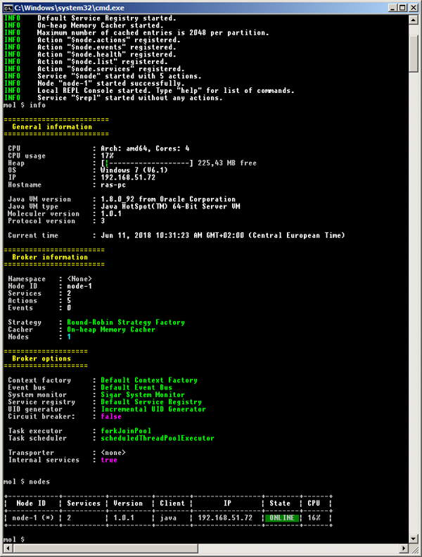


## REPL Commands

```
Commands:

  actions [options]                           List of actions
  bench <action> [jsonParams]                 Benchmark a service
  broadcast <eventName>                       Broadcast an event
  broadcastLocal <eventName>                  Broadcast an event locally
  call <actionName> [jsonParams]              Call an action
  clear <pattern>                             Delete cached entries by pattern
  dcall <nodeID> <actionName> [jsonParams]    Direct call an action
  emit <eventName>                            Emit an event
  env                                         Lists of environment properties
  events [options]                            List of event listeners
  exit, q                                     Exit application
  find <fullClassName>                        Find a class or resource
  gc                                          Invoke garbage collector
  info                                        Information about the broker
  memory                                      Show memory usage
  nodes [options]                             List of nodes
  props                                       List of Java properties
  services [options]                          List of services
  threads                                     List of threads
```

### List nodes

```bash
mol $ nodes
```

**Options**

```
    --help                    output usage information
    --details, -d             detailed list
    --all, -a                 list all (offline) nodes
    --raw                     print service registry as JSON
    --save [filename], -a     save service registry to JSON file
```

**Output**

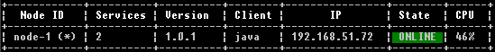

**Detailed output**

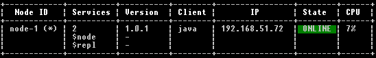

### List services

```bash
mol $ services
```

**Options**

```
    --local, -l           only local services
    --skipinternal, -i    skip internal services
    --details, -d         print endpoints
    --all, -a             list all (offline) services
```

**Output**

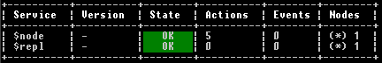

**Detailed output**

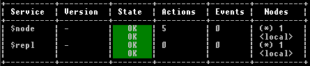


### List actions

```bash
mol $ actions
```

**Options**
```
    --local, -l           only local actions
    --skipinternal, -i    skip internal actions
    --details, -d         print endpoints
    --all, -a             list all (offline) actions
```

**Output**

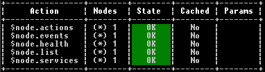

**Detailed output**

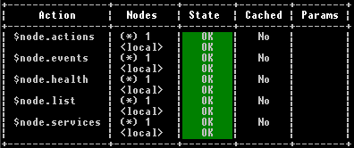

### List events

```bash
mol $ events
```

**Options**

```
    --local, -l           only local event listeners
    --skipinternal, -i    skip internal event listeners
    --details, -d         print endpoints
    --all, -a             list all (offline) event listeners
```

**Output**

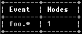

**Detailed output**

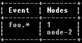

### Show common information

```bash
mol $ info
```

**Output**

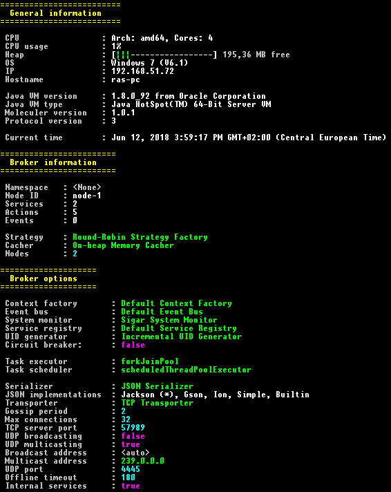

### List environment variables

```bash
mol $ env
```

### List system properties of JavaVM

```bash
mol $ props
```

### Call an action

```bash
mol $ call math.add {"a":3,"b":4}
```

**Output**

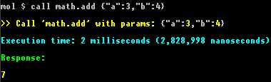

#### Call an action with parameters

```bash
mol $ call math.add --a 5 --b Bob --c --no-d --e.f "hello"
```

#### Call with JSON string parameter

```bash
mol $ call math.add {"a": 5, "b": "Bob", "c": true, "d": false, "e": { "f": "hello" } }
```

Params will be `{"a":5, "b":"Bob", "c":"--no-d", "e":{ "f":"hello" }}`

**Output**

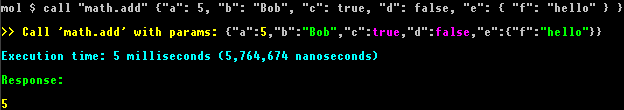

### Direct call

Get health info from `node-12` node

```bash
mol $ dcall node-12 $node.health
```

>Parameter passing is similar to `call` command.

### Emit an event

```bash
mol $ emit user.created
```

#### Emit an event with parameters

```bash
mol $ emit user.created --a 5 --b Bob --c --no-d --e.f "hello"
```

Params will be `{"a":5, "b":"Bob", "c":"--no-d", "e":{ "f":"hello" }}`

### Benchmark services

Moleculer REPL module has a new bench command to measure your services.

```bash
# Call service until 5 seconds (default)
mol $ bench $node.list
```

**Output**

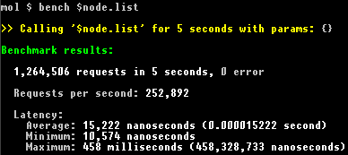

```bash
# Call service until 30 seconds
mol $ bench $node.list --time 30
```

**Output**

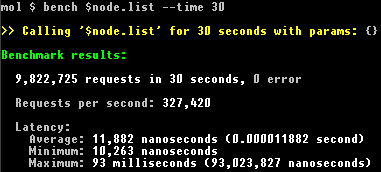

```bash
# Call service 5000 times
mol $ bench $node.list --num 5000
```

**Output**


#### Parameters

```bash
mol $ bench math.add --time 10 --a 3 --b 6
# or
mol $ bench math.add --time 10 {"a":3,"b":6}
```

**Output**

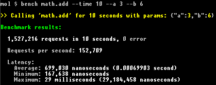

### Dump hierarchy of threads

```bash
mol $ threads
```

**Output**

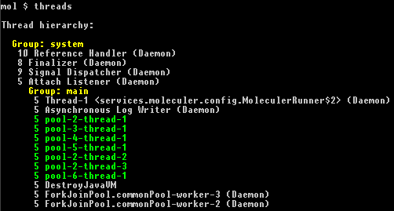

### Show JVM's heap usage

```bash
mol $ memory
```

**Output**

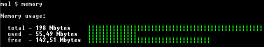

### Invoke Garbage Collector

```bash
mol $ gc
```

**Output**

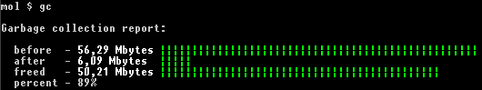

## User-defined commands

You can define your custom REPL commands in broker options to extend Moleculer REPL commands.

**Source of the "hello" console command**

```java
package my.commands;

import java.io.PrintWriter;
import java.util.Arrays;
import java.util.List;

import services.moleculer.ServiceBroker;
import services.moleculer.repl.Command;
import services.moleculer.service.Name;

@Name("hello")
public class HelloCommand extends Command {

	public HelloCommand() {
		option("uppercase, -u", "uppercase the name");
	}
	
	@Override
	public String getDescription() {
		return "Call the greeter.hello service with name";
	}

	@Override
	public String getUsage() {
		return "hello [options] <name>";
	}

	@Override
	public int getNumberOfRequiredParameters() {
		
		// One parameter (the "name") is required
		return 1;
	}

	@Override
	public void onCommand(ServiceBroker broker, PrintWriter out, String[] parameters) throws Exception {
		
		// Parse parameters
		List<String> params = Arrays.asList(parameters);
		boolean uppercase = params.contains("--uppercase") || params.contains("-u");
		
		// Last parameter is the name
		String name = parameters[parameters.length - 1];
		if (uppercase) {
			name = name.toUpperCase();
		}
		
		// Call the "greeter.hello" service
		broker.call("greeter.hello", name).then(rsp -> {
			
			// Print response
			out.println(rsp.asString());
			
		}).catchError(err -> {
			
			// Print error
			err.printStackTrace(out);
			
		});
	}
}
```

**Source of the "greeter.hello" action**

```java
package my.services;

import services.moleculer.service.*;

@Name("greeter")
public class GreeterService extends Service {

	@Name("hello")
	public Action helloAction = ctx -> {
		return "Hello " + ctx.params.asString();
	};
	
}
```

**Installation of the "hello" command from code**

```java
ServiceBroker broker = new ServiceBroker();

// Start local REPL console
LocalRepl repl = new LocalRepl();
repl.setPackagesToScan("my.commands");
broker.createService("$repl", repl);
```

**Installation of the "hello" command with Spring**

```xml
<bean id="$repl" class="services.moleculer.repl.LocalRepl">
	<property name="packagesToScan" value="my.commands" />		
</bean>
```

**Output of "help" command**

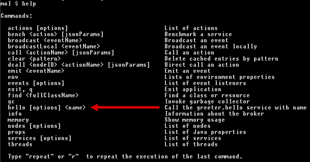

**Invoke the "hello" command**

```bash
mol $ hello -u John
Hello JOHN
```

# License

Moleculer-java-repl is available under the [MIT license](https://tldrlegal.com/license/mit-license).
